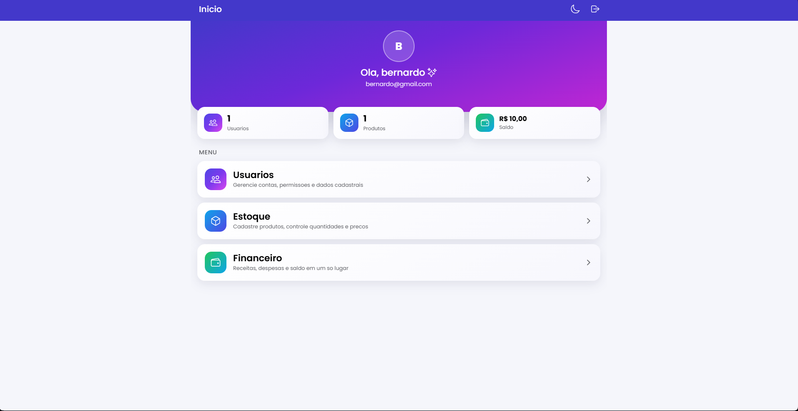
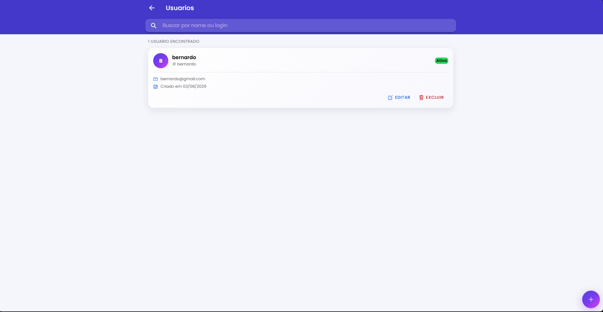
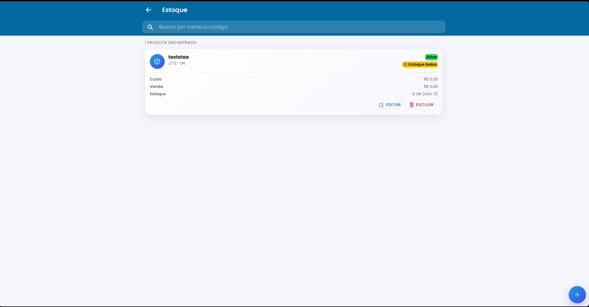
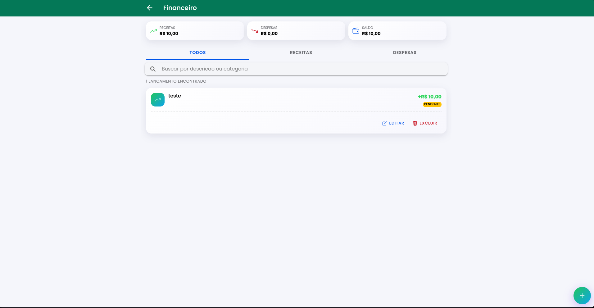

<div align="center">

# Sistema de Gestão

Backend em **Spring Boot** + frontend em **Ionic/Angular**, com autenticação JWT segura (cookie `HttpOnly`), tema claro/escuro, navegação por abas e quatro módulos: **Usuários**, **Estoque**, **Financeiro** e **Relatórios**.

Funciona no navegador e como app nativo Android/iOS (via Capacitor), a partir do mesmo código.

</div>

## Capturas de tela

<table>
<tr>
<td width="50%">

**Dashboard**
Indicadores rápidos (usuários, produtos, saldo) e acesso aos módulos.



</td>
<td width="50%">

**Usuários**
Listagem com busca, edição e exclusão, cartão com dados do usuário.



</td>
</tr>
<tr>
<td width="50%">

**Estoque**
Produtos com preço, quantidade e alerta de estoque baixo.



</td>
<td width="50%">

**Financeiro**
Receitas, despesas e saldo, com filtro por tipo e status.



</td>
</tr>
</table>

## Funcionalidades

| Módulo | O que faz |
|---|---|
| **Login / Cadastro** | Autenticação com bloqueio após tentativas falhas e política de senha forte |
| **Home** | Dashboard com indicadores rápidos, alertas de estoque baixo/contas a vencer e atalhos para cada módulo |
| **Usuários** | CRUD com busca por nome/login, paginação, edição do próprio usuário logado |
| **Estoque** | Produtos a vulso: código, categoria, unidade de medida, preços, estoque e alerta de estoque baixo |
| **Financeiro** | Lançamentos de receita/despesa com forma de pagamento, status e resumo de saldo |
| **Relatórios** | Painel com gráficos (financeiro mensal, distribuição por categoria) e lista de produtos com estoque baixo |
| **Navegação** | Barra de abas fixa (Início, Financeiro, Estoque, Relatórios, Usuários), com tema claro/escuro salvo por dispositivo |

## Stack

**Backend:** Java 21 · Spring Boot 3.3 · Spring Security (JWT em cookie `HttpOnly`) · Spring Data JPA · PostgreSQL · Flyway · Bean Validation · BCrypt

**Frontend:** Angular 18 (standalone) · Ionic 8 (ion-tabs) · Capacitor 6 · Reactive Forms · AuthGuard + Interceptors · Gráficos em SVG nativo (sem dependências externas)

## Segurança

- Token JWT em cookie `HttpOnly` + `SameSite=Strict` — nunca acessível via JavaScript no navegador.
- Bloqueio de login após 5 tentativas falhas (15 min).
- Senha forte obrigatória (8+ caracteres, letra e número).
- BCrypt fator de custo 12, headers HTTP de segurança (HSTS, `X-Frame-Options`, etc.), CORS restrito a origens explícitas.

## Estrutura de pastas

```
meu-projeto/
├── backend/                         # Spring Boot (Java)
│   └── src/main/
│       ├── java/com/empresa/sistema/
│       │   ├── controller/ service/ repository/ entity/
│       │   ├── dto/ security/ config/ exception/
│       └── resources/
│           ├── application.yml
│           └── db/migration/        # Scripts Flyway
│
└── frontend/                        # Ionic + Angular
    └── src/app/
        ├── core/                    # services, guards, interceptors, models
        └── pages/
            ├── login/ register/
            ├── tabs/                # shell com a barra de abas (ion-tabs)
            └── home/ usuarios/ estoque/ financeiro/ relatorios/
```

## Pré-requisitos

- **Java 21** (JDK) + **PostgreSQL** 14+ (banco já criado — o projeto só cria as tabelas)
- **Node.js** 18+ e **npm**
- `npm install -g @angular/cli @ionic/cli`
- Para build mobile: **Android Studio** (Android) ou **Xcode**, só macOS (iOS)

> Maven não precisa ser instalado — o projeto já inclui o wrapper (`./mvnw`).

## Configuração

Variáveis de ambiente do backend (`backend/src/main/resources/application.yml`), todas com valor padrão para desenvolvimento local:

| Variável | Padrão (dev) |
|---|---|
| `DB_HOST` / `DB_PORT` / `DB_NAME` | `localhost` / `5432` / `sistema_db` |
| `DB_USER` / `DB_PASSWORD` | `postgres` / `postgres` |
| `SERVER_PORT` | `8080` |
| `JWT_EXPIRATION_MS` | `7200000` (2h) |
| `COOKIE_SECURE` | `false` (defina `true` em produção com HTTPS) |
| `CORS_ALLOWED_ORIGINS` | `http://localhost:4200,http://localhost:8100,capacitor://localhost,ionic://localhost` |

As migrações do Flyway rodam **automaticamente** ao subir o backend — não precisa de comando manual.

No frontend, a URL da API fica em `frontend/src/environments/environment.ts` (`apiUrl`).

---

## Como rodar

### 1. Backend

```bash
cd backend
./mvnw spring-boot:run
```
API em `http://localhost:8080`.

### 2. Frontend no navegador

```bash
cd frontend
npm install
ionic serve
```
Abre em `http://localhost:8100` (ou `ng serve` → `http://localhost:4200`).

### 3. Testar no celular (rápido, pelo navegador)

1. Descubra o IP do seu PC na rede local (`ipconfig`, algo como `192.168.x.x`).
2. Suba o frontend aceitando conexões externas: `npx ng serve --host 0.0.0.0`
3. No `environment.ts`, troque `apiUrl` para `http://SEU_IP:8080`.
4. No celular, na mesma rede Wi-Fi, acesse `http://SEU_IP:4200` pelo navegador.

### 4. Build nativo Android/iOS (via Capacitor)

```bash
cd frontend
ionic build
npx cap add android     # ou ios —> só na primeira vez
npx cap sync
npx cap open android    # abre no Android Studio (ou "open ios" no Xcode)
```
Rode pela IDE em um emulador ou aparelho físico. Após qualquer mudança no código, repita `ionic build && npx cap sync`.